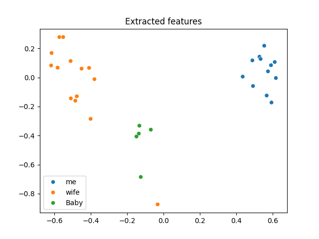
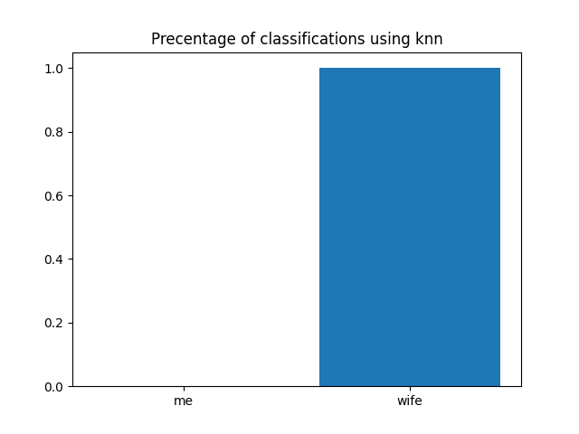
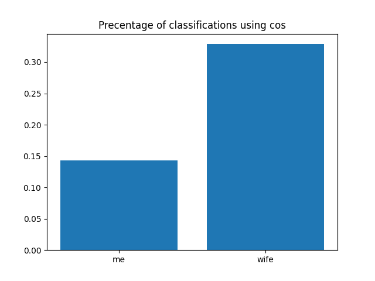
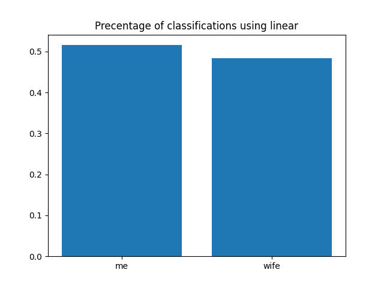

# ALIA LOOKS LIKE ME!

Since the birth of my daughter, Alia, exactly 2 months ago, everyone keeps saying she looks like my wife and less so like me, and I've had it with the propaganda.

In this repository, I aim to MATHEMATICALLY PROVE that my daugher actually looks like me. Thus proving that I am also cute and pretty.

## Methodology
I'll explore multiple face recognition, feature extraction, classification, and clustering models to see who they agree with, AND THEN ONLY HIGHLIGHT THE ONES THAT AGREE WITH ME!

This is going to be a long-running project where I try out new methods as I find them interesting (and find the time to do so between diaper changes), and keep evaluating all methods observed thus far wih newer pictures as my little one grows up (TO LOOK MORE AND MORE LIKE ME!)

The classification results are an average prediction probability (or similarity in case of using `cos` as a "classifier") of the N images of Alia that I have in the target dataset. This yields a single number per class in the input dataset (pictures of me and my wife)

## Getting Started

If you, for some reason, decide to try and use this to solve domestic disputes at home regarding face similarity issues, here's how to do it
1. Clone this repo locally
2. Download the required libraries using `pip install -r requirements.txt` (I would recommend creating a venv by first using `python -m venv <PATH_TO_VENJV>`)
3. Curate a dataset of pictures of the parties involved/. Consider the faces of the people you want to judge as the training data (me and my wife in this case) and the photos of the person you want to see the resemblance to (daughter in this case) as test data.
4. Put the training data into a directory, where pictures of the same person are grouped in a single subdirectory (example `/training/me, /training/wife`. And put the test data in another directory.
5. Run the program using `python main.py` and give the appropriate CLI arguments as indicated by the help text.
   
## Used Methods
This will have a list of used models so far, along with their results.

### Face detection
MTCNN. PyTorch implementation can be found in references

### Feature extraction
Facenet. PyTorch implementation can be found in references

## Results
### First exploration
I started by extracting facial features using Facenet and then reducing the extracted 512-dimensional vectors to 2 dimensions using PCA in order to visualize them. This yielded the following figure

This is not very encouraging and would suggest Alia looks indeed more like my wife than me. NOT GOOD ENOUGH!

### Classification
Starting with old trusty, the KNN classifier. This guy suggests that Alia looks 100% like my wife. DAMMIT!

Maybe just looking at similarity, instead of classification, is a better indicator of, well SIMILARITY OF FACES! Maybe I have a winner here that will prove my point! 

Nevermind, this suggests that my daughter is twice as similar to my wife as she is to me :( I should just give up?

Wait, I know, neural networks are a thing, right? people seem to really trust them and take their output as truth, so let's train a very simple one (actually, just a single linear layer because I'm lazy)

YES! This horrible, terrible model, going from 512 dimensions to 2 classes in a single step, trained only on 10 photos each of me and my wife, suggests that I'M THE WINNER! THIS IS SCIENCE, PEOPLE!

## Future
Unfortunately, my short vacation is at an end and I may develop this thing even slower, but I plan on adding more family members to the base dataset, and keep updating the target dataset with newer and newer pictures of Alia (possibly separating them by age to see how the results evolve in time).
Doing manual feature extraction is something that I definitely want to do as well, although that takes more time

## References
Here is a list of the resources that I've found useful in this endeavor
 - https://github.com/timesler/facenet-pytorch. A PyTorch implementation of facenet and MTCNN, this is my starting point. 

## License
Feel free to use this crappy code as you see fit, MIT style yo!
